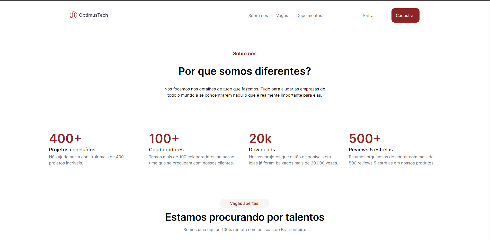

# OptimusTech
<h1 align="center"> Optimus Tech</h1>

Projeto feito para a criação de um site empresarial utilizando das tencologias atuais e tendo como objetivo de utilizar o front end sem JS e da estrutura back end.  

  <a href="#-tecnologias">Tecnologias</a>&nbsp;&nbsp;&nbsp;|&nbsp;&nbsp;&nbsp;
  <a href="#-projeto">Projeto</a>&nbsp;&nbsp;&nbsp;|&nbsp;&nbsp;&nbsp;
  <a href="#memo-licença">Licença</a>

  

 

  

## 🚀 Tecnologias

Esse projeto foi desenvolvido com as seguintes tecnologias:

- React
- Tailwind
- HTML
- Github
- Figma

## 💻 Projeto

- [Visite o projeto online]( https://helenapl145.github.io/OptimusTech/)
## :memo: Licença

Esse projeto está sob a licença MIT.

---

Feito com ♥ by Helena Lima

